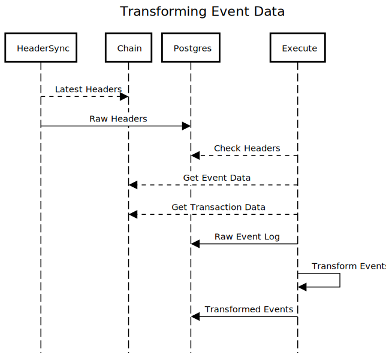

# Transformers

## Architecture

Event Transformers fetch raw event log data from the `public.event_logs` table, decode them and convert them into more specific tables in the postgres database. For example the `vat_move` transformer takes a raw event log and transforms it into the `maker.vat_move` table with `src`, `dst` and `rad` as fields. These fields are now available in the API.

For more detail see the doc at the bottom of the document. 

## Event Types

There are three types of log events we track.
  
1. Custom events that are defined in the contract solidity code.
1. `LogNote` events which utilize the [DSNote library](https://github.com/dapphub/ds-note).
1. `Note` events in the `Vat`

The transformer process for each of these different log types is the same, except for the converting process, as denoted below.

## Creating a Transformer

### Ensure there is a Contract
If the contract isn't already present in the environment you'll need to add it before you can begin transforming its events. To do so:

1. Get the contract address if you don't already have it.
1. Search for the contract on [etherscan](https://etherscan.io/). Bookmark this
   page, it is your new best friend.
1. In each environment (at this time testing, docker, and mcdTransformers) add a
   new contract to the contract section. For example:
   
    ``` toml
    [contract]
    [contract.MCD_FLIP_ETH_A_1.0.0]
        address  = "0xd8a04f5412223f513dc55f839574430f5ec15531"
        abi      = '<huge blob of json>'
        deployed = 8928180
    ```
 
    * The address field is the contract you searched for, as a string.
    * The abi can be found on the `contracts` tab in Etherscan (scroll down). You'll need the entire thing as a string, so it's best to use single quotes like above.
    * The deployed field is the block number of the transaction where the contract was deployed. That can be found on the Contract's page, by looking for the Contract Creator and clicking it's transaction hash. That will take you to the transaction where the it was deployed on.

### Create the Transformer
    
To create a custom transformer you will need to create a new `Transformer`
struct with a `ToModels` method on it which converts a `core.EventLog` object
(the raw, untransformed data) to an `event.InsertionModel` (the domain object).

Much of the time it is possible to complete this step without creating the database
migration, because to write the transformer you don't actually save the transformed
object to the database. You may be saving addresses, which
go into the already existing address table and are referenced by a foreign key. 

This isn't always the case, but if you do need to create the
migration, you'll know, because the tests won't pass. 

1. Search for the contract on etherscan using it's signature. 
1. Find the events for the contract in the contract's source.
1. For each event in the contract:
   1. Write a test for the event signature in [`signature_test.go`](../shared/constants/signature_test.go)
      1. To find out the event's signature you can use this [Keccak-256 calculator](https://emn178.github.io/online-tools/keccak_256.html). For example:
         * Search Etherscan for the contract `0x39755357759cE0d7f32dC8dC45414CCa409AE24e`.
         * Open the 'Contract' tab and in the contract source code and search for the `LogItemUpdate` event. It looks like this: `event LogItemUpdate(uint id);`.
         * You can copy that string and paste it into the Keccak-256 calculator (link above). Remove the parameter names, leaving only the types. Use `uint256` for the `uint` and `int256` for `int` as those are the solidity defaults, e.g. `LogItemUpdate(uint256)`. This will output an event signature.
         * To verify you got the signature right you can take that signature (in this case `a2c251311b1a7a475913900a2a73dc9789a21b04bc737e050bbc506dd4eb3488`) and search for it on the events tab of the contract. Make sure you prefix it with `0x`. The results should include the event you are looking for, provided one already exists for it.
      1. Make the test pass by updating the function list in `signature.go` as well as updating `method.go` as needed. Both of these files are in the constants package.
      1. Create test event in [`test_data`](../test_data)
         * Use Data from a real event in Etherscan wherever possible. Particularly when it comes to Topics and the Data entries. You'll thank me later.
         * Update constants as needed. Look at older examples of test data for inspiration.
   1. Create a new directory in `events` named after your new transformer. This will be the package your transformer is stored in.
   1. Create three files - `transformer.go`, `transformer_test.go` and `<package_name>_test.go` in the new directory. See the other transformers for examples. 
   1. `<package_name>_test.go` lets `gingko` run tests in this directory. The file should look something like this (this can be generated with `gingko`):
       
       ```go
       package <package_name>_test

       import (
           "testing"

           . "github.com/onsi/ginkgo"
           . "github.com/onsi/gomega"
       )

       func Test<EventName>(t *testing.T) {
           RegisterFailHandler(Fail)
           RunSpecs(t, "<PackageName>  Suite")
       }
       ```
   1. Implement the `ToModels` function in `transformer.go` with the appropriate testing in `transformer_test.go` of course. This means converting the raw log into a go struct. For clarity you're implementing this [interface](https://github.com/makerdao/vulcanizedb/blob/prod/libraries/shared/factories/event/converter.go).
      1. For custom events:
         1. You can convert each EventLog entry into an entity using the function `contract.UnpackLog(&entity, "<EventLogName>", log.Log)`. The entity is usually defined (by you) in a file called `entity.go` in the same package as the transformer. You can use the [abigen](https://geth.ethereum.org/docs/install-and-build/installing-geth) tool that comes with `Geth` as well, if you're struggling with getting the fields right, but it's usually simpler to just do it yourself. See the transformer in `transformers/events/log_make` for an example of this method.
         1. After converting the log entry to an entity, look up all of it's foreign keys from it's data and assign them to the entity.
         1. From the entity create an InsertionModel, which you return.
      1. For `LogNote` events you'll need to look at the method signature of the method that is calling them, because LogNote events are a generic structure. For example:
         * The `tend` method is called on the [flip.sol contract](https://github.com/makerdao/dss/blob/master/src/flip.sol#L123), and its method signature looks like this: `tend(uint,uint,uint)`.
         * Only the first four bytes of the Keccak-256 hashed method signature will be located in `topic[0]` on the log, unlike custom events.
         * The message sender will be in `topic[1]`.
         * The first parameter passed to `tend` becomes `topic[2]`.
         * The second parameter passed to `tend` will be `topic[3]`.
         * Any additional parameters will be in the log's data field.
         * More detail is located in the [DSNote repo](https://github.com/dapphub/ds-note).
         * For an example implementation look at the `flip_sol` transformer.
      1. If, while implementing the transformer and its corresponding unit tests you find you need to migrate the database see below. 

### Store the data in the database

1. Use the `make new_migration` task to create a new migration.
   * Each event log has its own table in the database.
   * The specific log event tables are all created in the `maker` schema.
1. The new migration can be run by running `make test` or `make migration NAME=<database_name>`. Note that if you need to modify the migration multiple times you do not need to rollback the new migration, `make test` will drop it and recreate it.
1. To verify that the migration will work create an integration for the shiny
   new transformer in [`integration_tests`](../integration_tests).
   * Unlike the transformer test you wrote earlier integration tests use their own `TransformerConfig` to run the transformer in the same way it will be in production.
   * You don't look at the event transformer directly, but query from the database.
   * These tests hit the internet as well, and will need real block numbers.
   * For best results look at one of the other tests in the `integration_tests` directory, and use real data from etherscan/mainnet.
1. Integration tests can be run with `make integrationtest`.

### Add the transformer to the list of transformers to run

Finally you can add the transformer to the list of transformers by updating the
configuration, and creating an initializer for the transformer.
 
1. In the config file (environments/mcdTransformers.toml) add the new package name the list of `transformerNames`
 in the exporter - alphabetically.
1. Underneath that list add a configuration (alphabetically again) to list of
   configurations. For example:
   
    ``` toml
    [exporter.vat_init]
        path = "transformers/events/vat_init/initializer"
        type = "eth_event"
        repository = "github.com/makerdao/vdb-mcd-transformers"
        migrations = "db/migrations"
        contracts = ["MCD_VAT"]
        rank = "0"
    ```
1. Note the path to the initializer is a directory named initializer in your new event transformer package. Of course you haven't created that yet. Create that directory and inside it create a file named `initializer.go`. 
1. Initializers are boilerplate that tell the system how to create your transformer. They look like this:
   
    ```go
    package initializer

    import (
    "github.com/makerdao/vdb-mcd-transformers/transformers/events/log_delete"
    "github.com/makerdao/vdb-mcd-transformers/transformers/shared"
    "github.com/makerdao/vdb-mcd-transformers/transformers/shared/constants"
    "github.com/makerdao/vulcanizedb/libraries/shared/factories/event"
    )

    var EventTransformerInitializer event.TransformerInitializer = event.ConfiguredTransformer{
    Config:      shared.GetEventTransformerConfig(constants.LogDeleteTable, constants.LogDeleteSignature()),
    Transformer: log_delete.Transformer{},
    }.NewTransformer
    ```

    Simply replace the constants and package names with your transformer.

1. Generate a new version of the transformerExporter with `plugins/execute/transformerExporter.go`  using the `vulcanizedb` compose command like so: `./vulcanizedb compose --config=/path/to/config.toml`.

### Fetching Logs

In the event there are not logs for an event you're looking to transform in Etherscan (be it in Mainnet, Kovan or other) you can generate an example raw event by deploying the contract to a local chain and emitting the event manually.

1. Fetch the logs from the chain based on the example event's topic zero:
   * The topic zero is based on the keccak-256 hash of the log event's method signature. These are located in [`pkg/transformers/shared/constants/signature.go`](../shared/constants/signature.go). 
   * Fetching is done in batch from the [`watcher`](https://github.com/vulcanize/maker-vulcanizedb/blob/prod/libraries/shared/watcher/event_watcher.go). 
   * The logs are then chunked up by the [`chunker`](https://github.com/vulcanize/maker-vulcanizedb/blob/prod/libraries/shared/chunker/log_chunker.go) before being delegated to each transformer.

## Useful Documents

[Ethereum Event ABI Specification](https://solidity.readthedocs.io/en/develop/abi-spec.html#events)

## Diagram

This shows the entire process, from the perspective of the `execute` process. Writing transformers means writing code for the little loop near the end.


